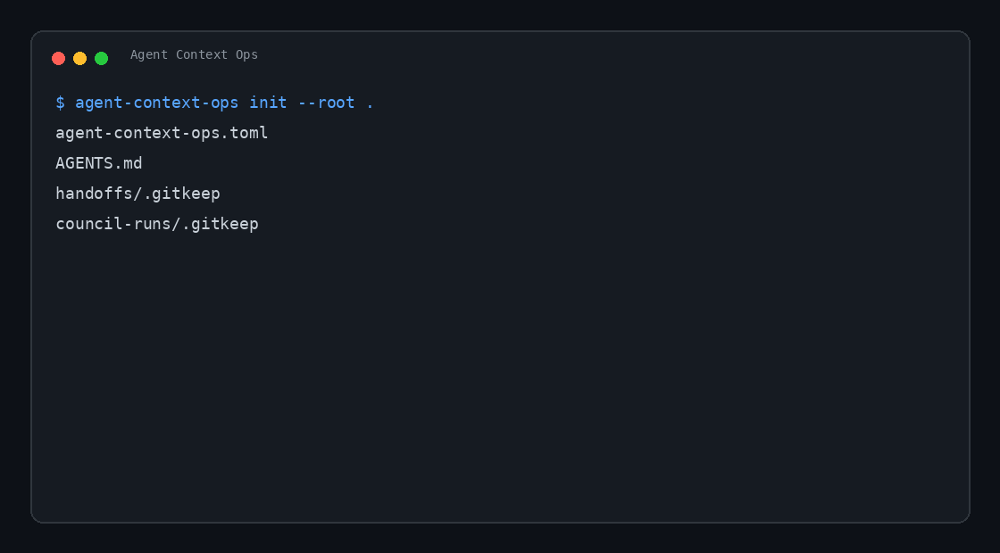

# Agent Context Ops

[](https://github.com/Mendel43/agent-context-ops/actions/workflows/ci.yml)

[](LICENSE)

Stop pasting messy context between AI coding agents.

Agent Context Ops is a small, file-based CLI for keeping AI coding agents grounded
in real project context without leaking secrets.

It helps maintainers hand work between tools such as Codex, Claude Code, Hermes,
Obsidian and local knowledge graphs without copying private chat history by hand.



## Use cases

- Generate a clean Markdown handoff before moving work to another agent.
- Run a quick readiness check before sharing context.
- Scan for secret-looking content in exported files.
- Check whether a local knowledge graph is stale.
- Verify that critical files have recent backups.
- Write lightweight operational notes to an Obsidian vault.
- Store read-only multi-agent review logs.

## Why it exists

AI agents are powerful, but long-running projects lose time when every session starts
from zero. Maintainers need a lightweight way to preserve decisions, operational
status, useful commands, architecture notes and pending work in files that any agent
can read.

This project is designed for real-world maintainer workflows:

- issue and PR triage;
- release notes and changelog drafts;
- context recovery after long sessions;
- automation audits;
- safer handoffs between coding agents;
- project memory that lives in the repo, not only in chat history.

## Install

From a local checkout:

```bash
pip install -e .
```

Verify the installation:

```bash
agent-context-ops --version
```

## Quick start

Initialize a project:

```bash
agent-context-ops init --root .
```

Generate a redacted handoff for another AI agent:

```bash
agent-context-ops context-pack --root . --output handoff.md
```

By default, the handoff hides your absolute local root path. Use
`--show-root-path` only for same-machine handoffs that need the exact path.

See a sample output: [`examples/output/context-pack.md`](examples/output/context-pack.md).

Run a readiness check:

```bash
agent-context-ops doctor --root .
```

Check if a local knowledge graph is stale:

```bash
agent-context-ops graph-check --root . --graph graphify-out/graph.json
```

Check that critical files have backups:

```bash
agent-context-ops backup-check --root . --file pyproject.toml --backup-dir backups
```

Scan for secret-looking content:

```bash
agent-context-ops scan-secrets --root .
```

Write an operational note to an Obsidian vault:

```bash
echo "Release prep finished." | agent-context-ops obsidian-log \
  --vault /path/to/vault \
  --folder "AI Logs" \
  --title "Release prep"
```

Short alias:

```bash
aco context-pack --root .
```

## Commands

| Command | Purpose |
| --- | --- |
| `init` | Create `agent-context-ops.toml`, `AGENTS.md`, and handoff folders. |
| `doctor` | Check context readiness before sharing work with another agent. |
| `context-pack` | Generate a redacted Markdown handoff. |
| `scan-secrets` | Find secret-looking content before exporting context. |
| `graph-check` | Detect whether a local `graph.json` is stale. |
| `backup-check` | Confirm critical files have recent backup candidates. |
| `obsidian-log` | Write a Markdown note into an Obsidian vault. |
| `council-log` | Store read-only multi-agent review outputs. |

## Development smoke test

```bash
make smoke
make scan
```

## Safety principles

- Never export secrets.
- Never include `.env` contents.
- Never mutate cron jobs or deployment configs without explicit command flags.
- Prefer read-only diagnostics by default.
- Keep generated context short enough to paste into another model.

## Status

`v0.2.1` is the current patch release. It keeps the smart context-pack work from
`v0.2.0` and tightens release metadata before the next feature milestone. The
project is intentionally small, local-first and built around safe handoffs,
preflight checks and cross-platform verification.
